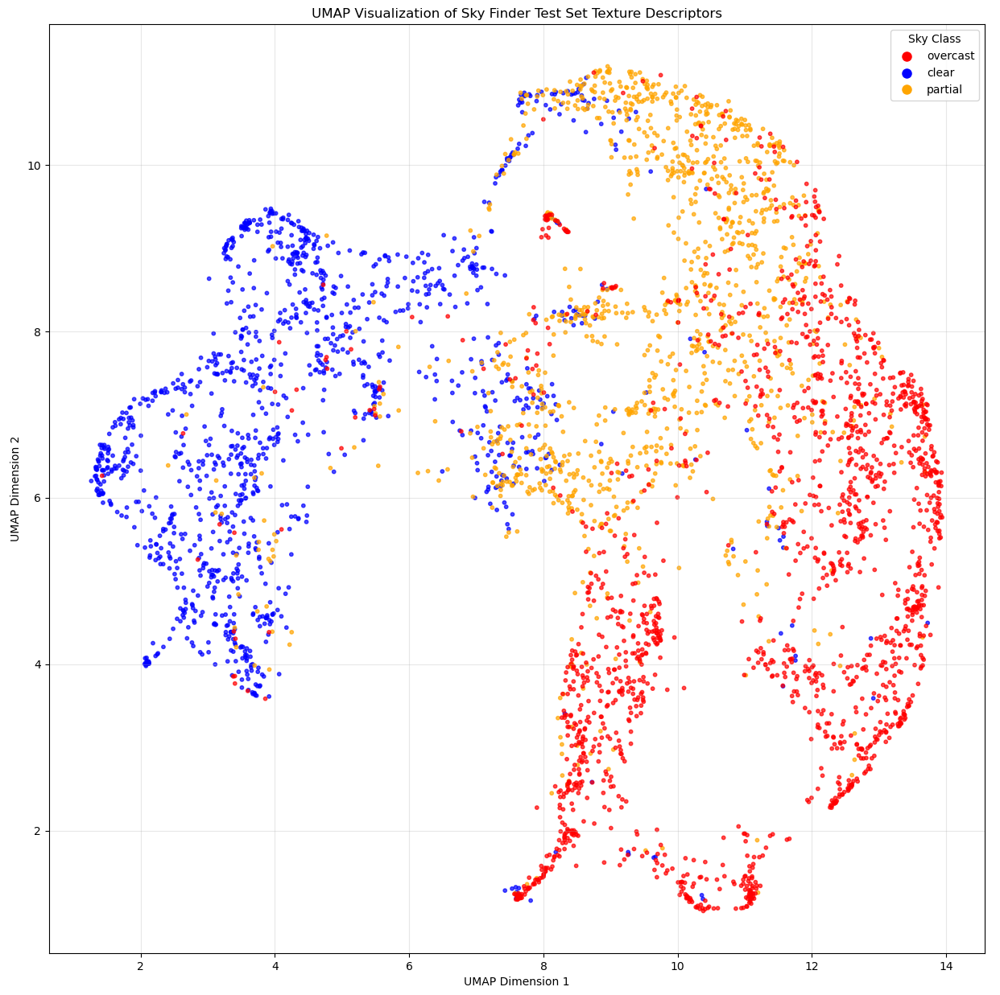
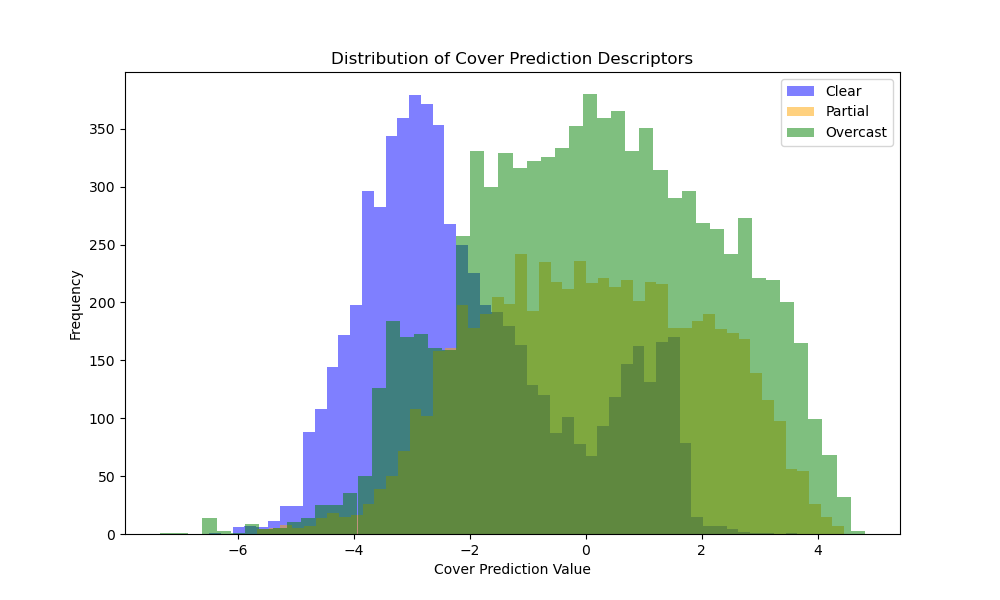

## 1. Texture Descriptor

The texture descriptor leverages the Sky Finder dataset [1], which contains a rich variety of sky imagery. We manually categorized the 20 most relevant scenes into three distinct classes: clear, partial, and overcast, based on sky conditions. Using this classified data, we trained a ResNet50 backbone [2] with a multi-layer perceptron head. The model was trained on a contrastive learning task, enabling it to extract meaningful texture representations from the diverse sky conditions present in the dataset.


### 1.1 Dataset

#### 1.1.1 Sky Finder Dataset

The Sky Finder dataset comprises high-resolution outdoor images captured across various locations, weather conditions, and times of day. Our preprocessing involves:

1. **Image Classification**: We manually categorized the 20 most representative scenes in the dataset into three classes based on sky visibility, yielding 21,490 images across the three classes:
    - **Clear**: (6,335 images) Scenes with predominantly visible blue sky and minimal cloud coverage.
    - **Partial**: (6,378 images) Scenes with mixed cloud and clear sky regions.
    - **Overcast**: (8,777 images) Scenes with complete or near-complete cloud coverage.
2. **Image Preprocessing**: Images are cropped based on manually labeled ground segmentation to remove non-sky regions, and then in-painted using TELEA algorithm [3] with a radius of 3 pixels to seamlessly fill any artifacts along the segmentation boundary.

For experimental evaluation, the dataset is divided into training, validation, and test sets containing 12,894 (60%), 4,298 (20%), and 4,298 (20%) images, respectively.

#### 1.1.2 Pair Generation for Contrastive Learning

Our contrastive learning framework relies on creating meaningful sample pairs:

1. **Positive Pairs**: For each processed image in the dataset, we generate two different augmented views of the same base image. These views are created through a series of transformations aiming to keep the core content of the image intact while introducing variability.

2. **Negative Pairs**: All other augmented views from different base images in the batch serve as negative examples. The model learns to distinguish these from the positive pairs.

<div align="center">
    
    <div align="center">
    <em>Figure 1: Pair generation process for contrastive learning. Each original image is cropped to remove the ground region, inpainted and augmented to create two images, which are then used as positive pairs.</em>
    </div>
</div>


### 1.2 Model Architecture

The texture descriptor employs a ResNet50 backbone pretrained on ImageNet as the feature encoder, with the original classification head replaced by a projection head. The projection head consists of a two-layer multi-layer perceptron (MLP) with ReLU activation between layers, mapping the 2048-dimensional ResNet50 feature vector to a 16-dimensional texture descriptor space. The final texture descriptors are L2-normalized.


### 1.3 Training Objective

We employ the Normalized Temperature-scaled Cross Entropy (NT-Xent) loss, which is formulated as:

$$L = -\log\frac{\exp(\text{sim}(z_i, z_j)/\tau)}{\sum_{k=1}^{2N}\mathbf{1}_{[k \neq i]}\exp(\text{sim}(z_i, z_k)/\tau)}$$

Where:
- $z_i$ and $z_j$ are normalized descriptors of two augmented views of the same image.
- $\text{sim}(u, v)$ denotes the cosine similarity between vectors $u$ and $v$.
- $\tau$ is a temperature parameter that controls the concentration level of the distribution.
- $N$ is the number of image pairs in the current batch.
- $\mathbf{1}_{[k \neq i]}$ is an indicator function that equals 1 when $k \neq i$.

This loss function encourages the model to learn representations where similar samples are pulled together in the texture descriptor space while dissimilar samples are pushed apart, resulting in a texture descriptor that effectively captures the distinctive characteristics of different sky conditions.


### 1.4 Training Procedure

Our texture descriptor model was trained with the following hyperparameters and configuration:

- **Optimizer**: AdamW with a learning rate of $10^{-4}$ and weight decay of $10^{-4}$.
- **Embedding Dimension**: 16 (latent space dimension at the end of the MLP head).
- **Batch Configuration**: 2 batches with 3 pairs per batch ($N=3$).
- **Training Duration**: 4 epochs.
- **Temperature Parameter**: 0.5 for the NT-Xent loss.
- **Learning Rate Scheduler**: Reduce learning rate on plateau with a patience of 1 epoch and a factor of 0.5.
- **Hardware**: Single NVIDIA RTX 3080 GPU with 10GB of memory.

This configuration provides a good balance between performance and computational efficiency, allowing the model to learn meaningful texture representations while remaining trainable on consumer-grade hardware.


### 1.5 Results

The trained texture descriptor model is evaluated on the Sky Finder dataset, and the results are visualized using UMAP [4]. The resulting plot illustrates how the model effectively clusters similar sky conditions together in the texture descriptor space.
<div align="center">
    
    <div align="center">
    <em>Figure 2: Embeddings plot of the trained model on the Sky Finder dataset. The plot illustrates how the model effectively clusters similar sky conditions together in the texture descriptor space.</em>
    </div>
</div>


### 1.6 Reproduction Procedure

Follow these steps to reproduce our texture descriptor results by generating the dataset, training the model and plotting the texture descriptor space.

#### 1.6.1 Sky Finder Dataset Generation

To prepare the dataset for training, execute the following commands which will download and organize the Sky Finder images according to our classification schema:

```bash
cd src/datasets
python generate_sky_finder_dataset.py [-w <max-workers>] [-f] [-r]
```
Parameters:
- `-w`, `--max-workers`: (Optional, default is 3) Specifies the maximum number of concurrent workers for downloading images. Higher values speed up the download process but require more system resources.
- `-f`, `--force`: (Optional, default is false) Forces the download and generation of the dataset even if it already exists locally, ensuring you have the latest version.
- `-r`, `--remove-data`: (Optional, default is false) Automatically removes the downloaded archive files and extracted files after successfully generating the processed dataset to save disk space.

#### 1.6.2 Training the Texture Descriptor

To train the texture descriptor model, execute the following commands:

```bash
cd src/contrastive_net
python contrastive_net_train.py
```

Model weights will be saved in the [data/models/contrastive_net](data/models/contrastive_net) directory. If you want to use your own model for further steps, manually rename and move the best checkpoint to [data/models/contrastive_net/baseline.ckpt](data/models/contrastive_net/baseline.ckpt).

#### 1.6.3 Generating Sky Finder Descriptors

To generate the descriptors for the Sky Finder dataset, execute the following commands:

```bash
cd src/pipeline
python generate_sky_finder_descriptors.py
```

The generated descriptors will be saved in the [generated/sky_finder_descriptors.json](generated/sky_finder_descriptors.json) file.

#### 1.6.4 Plotting the Texture Descriptor Space

To plot the texture descriptors and visualize the results, execute the following commands:

```bash
cd src/pipeline
python plot_texture_descriptor_space.py
```


## 2. Sky Cover Descriptor

The sky cover descriptor quantifies cloud coverage by performing regression-based segmentation of sky regions. This descriptor combines manually-labeled data from our repository with pseudo-labels derived from the Sky Finder dataset in an active learning framework. By estimating the cloud coverage percentage across all sky pixels, it provides a single numerical representation of sky conditions.


### 2.1 Datasets

#### 2.1.1 Sky Finder Cover Dataset

The Sky Finder Cover Dataset is a manually annotated subset of the Sky Finder Dataset with pixel-level cloud segmentation masks. This carefully curated dataset maintains the same classification schema (clear, partial, and overcast) as the original Sky Finder Dataset, providing high-quality ground truth for cloud segmentation tasks.

The dataset was created through a meticulous annotation process:
1. **Selection**: Representative images were selected from each sky condition category to ensure diversity.
2. **Manual Segmentation**: Annotators created pixel-precise binary masks, where each pixel is labeled as either overcast (white), partially covered (gray) or clear sky/ground (0).

For experimental evaluation, the dataset was divided into training and validation sets containing 182 and 58 images, respectively.

#### 2.1.2 Sky Finder Active Dataset

The Sky Finder Active Dataset leverages an active learning approach to expand the training data through high-confidence pseudo-labels:

1. **Initial Model Training**: A sky cover model was first trained on the manually annotated Sky Finder Cover Dataset, as detailed in Section 2.4.
2. **Pseudo-Label Generation**:
    - The trained model was applied to unlabeled images from the Sky Finder Dataset.
    - Prediction uncertainty was quantified using pixel-wise entropy measurements.
    - Only predictions with low entropy (high confidence) were selected.

For experimental evaluation, the training set was augmented with 359 high-confidence pseudo-labeled images, while the validation set was augmented with an additional 128 pseudo-labeled images. This active learning approach expands the available training data while maintaining quality through confidence-based selection.


### 2.2 Model Architecture

The sky cover descriptor employs a U-Net architecture with a ResNet50 backbone pretrained on ImageNet1K_V2 serving as the encoder. The decoder consists of upsampling blocks that progressively restore spatial resolution through bilinear interpolation, followed by convolutional layers. Skip connections from corresponding encoder levels are concatenated with decoder features at each resolution level, preserving fine-grained spatial information essential for accurate cloud segmentation.

The architecture incorporates a dual-output design to enhance learning guidance:

1. **Primary Output**: Pixel-wise cloud coverage estimation through the standard U-Net segmentation head.
2. **Auxiliary Classification Branch**: A secondary convolutional branch that processes the feature maps before the final segmentation layer to output a single scalar value between 0 and 1, representing the overall sky condition class (0 for clear, 0.5 for partial, 1 for overcast).

This auxiliary branch serves multiple purposes: it provides additional supervisory signal during training by leveraging existing image-level sky condition labels, enables evaluation of sky classification accuracy, and helps assess the quality of learned feature representations. Most importantly, it guides the learning process by enforcing consistency between pixel-level predictions and global sky conditions.


### 2.3 Training Objective

The training objective combines three complementary loss functions to optimize both segmentation accuracy and classification consistency:

$$\mathcal{L}_{\text{total}} = 0.5 \cdot \mathcal{L}_{\text{Focal}} + 0.5 \cdot \mathcal{L}_{\text{Dice}} + 0.1 \cdot \mathcal{L}_{\text{BCE}}$$

Where $\mathcal{L}_{\text{Focal}}$ is defined with $\alpha=0.5$ and $\gamma=2.0$ to focus on hard-to-classify examples:

$$\mathcal{L}_{\text{Focal}} = -\alpha(1-p_t)^\gamma\log(p_t)$$

Where $p_t$ is the predicted probability for the true class, $\alpha$ is the weighting factor for class balance, and $\gamma$ is the focusing parameter that down-weights easy examples.

$\mathcal{L}_{\text{Dice}}$ optimizes overlap between predicted and ground truth segmentations:

$$\mathcal{L}_{\text{Dice}} = 1 - \frac{2\sum_{i}^{N}p_i g_i}{\sum_{i}^{N}p_i^2 + \sum_{i}^{N}g_i^2 + \epsilon}$$

Where $p_i$ is the predicted probability for pixel $i$, $g_i$ is the ground truth label for pixel $i$, $N$ is the total number of pixels, and $\epsilon$ is a small constant for numerical stability.

And $\mathcal{L}_{\text{BCE}}$ provides supervision for the auxiliary classification branch using binary cross-entropy:

$$\mathcal{L}_{\text{BCE}} = -[y \log(\hat{y}) + (1-y) \log(1-\hat{y})]$$

Where $y$ is the ground truth sky condition class (0 for clear, 0.5 for partial, 1 for overcast) and $\hat{y}$ is the predicted classification score from the auxiliary branch.

This multi-objective loss function balances pixel-wise classification accuracy, structural similarity, and global sky condition consistency, resulting in improved cloud segmentation performance while providing interpretable classification outputs.


### 2.4 Training Procedure

Our sky cover descriptor model was trained with the following hyperparameters and configuration:

- **Optimizer**: AdamW with a learning rate of $10^{-4}$ and weight decay of $10^{-4}$.
- **Batch Configuration**: 2 batches.
- **Training Duration**: 100 epochs for the initial model trained on manual labels only, followed by 50 epochs for the active learning enhanced model with pseudo-labels.
- **Learning Rate Scheduler**: Reduce learning rate on plateau with a patience of 1 epoch and a factor of 0.5.
- **Hardware**: Single NVIDIA RTX 3080 GPU with 10GB of memory.

This configuration provides a good balance between performance and computational efficiency, allowing the model to learn meaningful cloud segmentation representations while maintaining training stability.


### 2.5 Results

The sky cover descriptor model was comprehensively evaluated using two training approaches and validation scenarios. We compare the initial model trained exclusively on manually annotated data against the active learning enhanced model that incorporates high-confidence pseudo-labels. The evaluation encompasses both manual-only validation and combined manual+pseudo-label validation datasets to assess model generalization across different data distributions.

<div align="center">
    <em>Table 1: Comprehensive performance comparison across training and validation configurations. Coverage Error represents the mean absolute percentage error in estimating cloud coverage. Sky Class Error represents the classification error rate for the three-class sky condition categorization (clear, partial, overcast).</em>
</div>

| Training Data | Validation Data | IoU | Dice Score | Coverage Error | Sky Class Error |
|---------------|-----------------|-----|------------|----------------|-----------------|
| Manual Labels Only | Manual Validation Set | 0.3632 | 0.4605 | 0.1380 | 0.2472 |
| Manual Labels Only | Manual + Pseudo Validation Set | **0.3697** | **0.4665** | **0.0927** | **0.2840** |
| Manual + Pseudo Labels | Manual Validation Set | 0.3905 | 0.4825 | 0.1365 | 0.2107 |
| Manual + Pseudo Labels | Manual + Pseudo Validation Set | **0.4408** | **0.5217** | **0.0824** | **0.2114** |

The comprehensive evaluation reveals several important insights about the active learning approach:

1. **Consistent Improvement**: The active learning enhanced model demonstrates superior performance across all metrics compared to the baseline model trained solely on manual annotations, with IoU improvements ranging from 7.5% to 19.3%.

2. **Domain Generalization**: Both models exhibit better performance when evaluated on the combined validation set that includes pseudo-labeled data, suggesting improved generalization to the broader data distribution represented in the Sky Finder dataset.

3. **Coverage Error Reduction**: The active learning approach significantly reduces coverage estimation errors, particularly evident in the combined validation scenario where coverage error decreases from 0.0927 to 0.0824.

4. **Segmentation Quality**: The Dice score improvements (4.8% to 11.8%) indicate that the active learning approach produces more accurate cloud boundary delineation, which is crucial for precise cloud coverage quantification.

**TODO**

<div align="center">
    
    <div align="center">
    <em>Figure 3: Visual comparison of cloud segmentation results. From left to right: original input images, ground truth segmentation masks, predictions from the baseline model trained on manual annotations only, and predictions from our active learning enhanced model.</em>
    </div>
</div>


### 2.6 Reproduction Procedure

#### 2.6.1 Training the Initial Sky Cover Model

To train the initial sky cover model on the manually annotated dataset, execute the following commands:

```bash
cd src/unet
python unet_train.py
```

Model weights will be saved in the [data/models/unet](data/models/unet) directory. Manually rename and move the best checkpoint to [data/models/unet/baseline_manual.ckpt](data/models/unet/baseline_manual.ckpt).

#### 2.6.2 Active Learning Enhancement

To enhance the model using the active learning approach with pseudo-labels, execute the following commands:

```bash
cd src/unet
python unet_train.py -a
```

Parameters:
- `-a`, `--active`: Enables active learning using the previously trained model checkpoint for pseudo-label generation.

The enhanced model weights will be saved in the [data/models/unet](data/models/unet) directory. Manually rename and move the best checkpoint to [data/models/unet/baseline_active.ckpt](data/models/unet/baseline_active.ckpt).

#### 2.6.3 Evaluating the Sky Cover Model

To evaluate the performance of the trained models, execute:

```bash
cd src/unet
python unet_eval.py
```
Parameters:
- `-a`, `--active`: (Optional) Use active learning checkpoint for evaluation instead of the baseline manual-only model.
- `-p`, `--with-pseudo-labelling`: (Optional) Include pseudo-labeled validation data in the evaluation.


## 3. Classification Head for Downstream Task

The classification head serves as the final component for sky condition classification, combining the texture and cover descriptors to classify images into clear, partial, and overcast scenes. This downstream task evaluates the effectiveness of our feature extraction methods in a practical sky classification scenario.

### 3.1 Dataset Preparation

To create a robust classification dataset, we manually curated a subset of the Sky Finder dataset with the following preprocessing steps:

1. **Manual Labeling**: We manually labeled a comprehensive subset of Sky Finder images, ensuring accurate ground truth for the three sky conditions.
2. **Night Sky Removal**: Night sky images were systematically removed from the dataset as they introduce significant lighting variations that could confound the classification task and are less relevant for most practical applications.

The final curated dataset maintains the same class distribution as reported earlier: Clear (6,335 images), Partial (6,378 images), and Overcast (8,777 images).

### 3.2 Model Architecture

The classification head employs a simple 3-layer fully connected network with dropout and ReLU activations between layers.

The network accepts either:
- **16-dimensional input**: Texture embeddings from the contrastive learning model
- **17-dimensional input**: Combined texture embeddings ($16D$) + cover prediction scalar ($1D$)
- **1-dimensional input**: Cover prediction alone for baseline comparison

### 3.3 Experimental Results

Our comprehensive evaluation reveals significant insights about the effectiveness of different descriptor combinations:

#### 3.3.1 Performance Comparison

| Configuration | Train Accuracy | Val Accuracy | Test Accuracy | Train F1 | Val F1 | Test F1 |
|---------------|----------------|--------------|---------------|----------|--------|---------|
| **ALL** (Texture + Cover Prediction) | 0.9133 | 0.9050 | 0.9100 | 0.9100 | 0.8956 | 0.9021 |
| **CONTRASTIVE_ONLY** (Texture) | **0.9209** | **0.9069** | **0.9144** | **0.9170** | **0.8977** | **0.9052** |
| **COVER_ONLY** (Cover Prediction) | 0.7681 | 0.7923 | 0.7852 | 0.0000 | 0.0000 | 0.0000 |

#### 3.3.2 Key Findings

1. **Contrastive Learning Superiority**: The texture descriptor derived from contrastive learning demonstrates exceptional performance, achieving the highest accuracy and F1 scores across all evaluation splits. This validates our hypothesis that contrastive learning effectively captures discriminative sky condition features.

2. **Cover Prediction Limitations**: The cover prediction alone shows a critical failure mode - complete inability to classify partial sky conditions (F1 = 0.0000). The confusion matrices reveal that the model defaults to binary classification, never predicting the partial class.

3. **No Synergistic Effect**: Combining texture and cover descriptors does not improve performance over using texture features alone, suggesting that the contrastive learning approach already captures the essential characteristics needed for sky classification.

#### 3.3.3 Analysis of Cover Prediction Failure

<div align="center">
    
    <div align="center">
    <em>Figure 4: Distribution of cover prediction values across sky condition classes. The substantial overlap between partial and overcast classes explains the classification difficulties.</em>
    </div>
</div>

The visualization of cover prediction ranges reveals a fundamental issue: the partial and overcast classes exhibit highly overlapping value distributions. This overlap can be attributed to several factors:

1. **Texture Ambiguity**: Overcast skies often lack distinctive textures, presenting uniform gray appearances that vary primarily in brightness rather than structural patterns.
2. **Lighting Variability**: The diverse range of lighting conditions in overcast scenes creates a continuum of cloud coverage appearances that are difficult to distinguish from partially cloudy conditions.

### 3.4 Implications and Conclusions

The experimental results provide several important insights for sky condition classification:

1. **Contrastive Learning Effectiveness**: The superior performance of texture-only classification demonstrates that contrastive learning successfully learns implicit representations that encompass both textural and coverage characteristics without requiring explicit coverage quantification.

2. **Feature Redundancy**: The lack of improvement when combining descriptors suggests that the contrastive learning approach already captures the relevant information provided by the cover prediction, making the additional descriptor redundant.

3. **Practical Recommendation**: For deployment scenarios, using only the 16-dimensional texture embeddings provides the optimal balance of performance and computational efficiency.

### 3.5 Reproduction Procedure

#### 3.5.1 Generate Sky Finder Descriptors

First, extract both texture and cover descriptors for the entire dataset:

```bash
cd src/classification
python generate_sky_finder_descriptors.py
```

This will create a comprehensive descriptor file at [/generated/sky_finder_descriptors.json](/generated/sky_finder_descriptors.json) containing both texture embeddings and cover predictions for all images in the dataset.

#### 3.5.2 Train Classification Models

Train the classification head with different input configurations:

```bash
cd src/sky_class_net
python sky_class_train.py
python sky_class_train.py --contrastive-only
python sky_class_train.py --cover-only
```

The model weights will be saved in the [data/models/sky_class_net](data/models/sky_class_net) directory. Manually rename and move the best checkpoint to [data/models/sky_class_net/all_baseline.ckpt](data/models/sky_class_net/all_baseline.ckpt), [data/models/sky_class_net/contrastive_only_baseline.ckpt](data/models/sky_class_net/contrastive_only_baseline.ckpt), and [data/models/sky_class_net/cover_only_baseline.ckpt](data/models/sky_class_net/cover_only_baseline.ckpt), respectively.

#### 3.5.3 Evaluate Performance

To generate the comprehensive evaluation metrics and confusion matrices, run:

```bash
cd src/sky_class_net
python sky_class_eval.py
```

This will produce detailed performance metrics, confusion matrices, and visualizations for all model configurations, enabling direct comparison of the different approaches.

# 4. Pipeline

After these findings, we decide to only use the contrastive model and we will add other descriptors on our own initial video data. videos enable us to have temporal-based and motion-based descriptors that could improve describability of the skies.

1. texture descriptor
2. mean green value
3. Optical flow
4. mean diff green over consecutive frames

# Reproducibility TODO

create gsam2 folder in src
cd gsam2
copy from github repository git clone https://github.com/IDEA-Research/Grounded-SAM-2?tab=readme-ov-file
remove root grounded-sam-2 to only have the gsam2 folder directly
cd checkpoints
bash download_ckpts.sh
cd gdino_checkpoints
bash download_ckpts.sh
cd ..
pip install -e .
pip install --no-build-isolation -e grounding_dino

## References

[1] Mihail et al., "Sky Finder: A Segmentation Benchmark for Sky Regions in the Wild," IEEE/CVF Winter Conference on Applications of Computer Vision (WACV), 2016.

[2] He et al., "Deep Residual Learning for Image Recognition," IEEE Conference on Computer Vision and Pattern Recognition (CVPR), 2016.

[3] Telea, A., "An Image Inpainting Technique Based on the Fast Marching Method," Journal of Graphics Tools, Vol. 9, No. 1, 2004.

[4] McInnes, L., Healy, J., and Melville, J., "UMAP: Uniform Manifold Approximation and Projection for Dimension Reduction," arXiv preprint arXiv:1802.03426, 2018.
