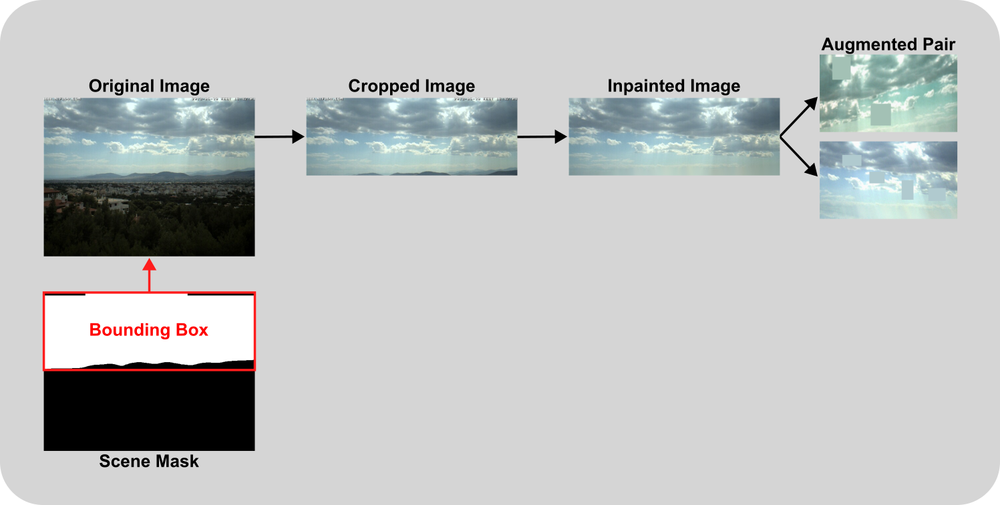

## Introduction

TODO

## 1. Texture Descriptor

The texture descriptor leverages the Sky Finder dataset [CITE], which contains a rich variety of sky imagery. We categorized the 20 most relevant scenes into three distinct classes: clear, partial, and overcast, based on sky conditions. Using this classified data, we trained a ResNet50 backbone [CITE] with a multi-layer perceptron head. The model was trained on a contrastive learning task, enabling it to extract meaningful texture representations from the diverse sky conditions present in the dataset.

### 1.1 Sky Finder Dataset

The Sky Finder dataset comprises high-resolution outdoor images captured across various locations, weather conditions, and times of day. Our preprocessing involves:

1. **Image Classification**: We manually categorized the 20 most representative scenes in the dataset into three classes based on sky visibility, yielding 21,490 images across the three classes:
    - **Clear**: (6,335 images) Scenes with predominantly visible blue sky and minimal cloud coverage.
    - **Partial**: (6,378 images) Scenes with mixed cloud and clear sky regions.
    - **Overcast**: (8,777 images) Scenes with complete or near-complete cloud coverage.
2. **Image Preprocessing**: Images are cropped based on manually labeled ground segmentation to remove non-sky regions, and then in-painted using TELEA algorithm [CITE] with a radius of 3 pixels to seamlessly fill any artifacts along the segmentation boundary.

### 1.2 Pair Generation for Contrastive Learning

Our contrastive learning framework relies on creating meaningful sample pairs:

1. **Positive Pairs**: For each processed image in the dataset, we generate two different augmented views of the same base image. These views are created through a series of transformations aiming to keep the core content of the image intact while introducing variability.

2. **Negative Pairs**: All other augmented views from different base images in the batch serve as negative examples. The model learns to distinguish these from the positive pairs.

<div align="center">
    
    <div align="center">
    <em>Figure 1: Pair generation process for contrastive learning. Each original image is cropped to remove the ground region, inpainted and augmented to create two images, which are then used as positive pairs.</em>
    </div>
</div>


### 1.3 Training Objective

We employ the Normalized Temperature-scaled Cross Entropy (NT-Xent) loss, which is formulated as:

$$L = -\log\frac{\exp(\text{sim}(z_i, z_j)/\tau)}{\sum_{k=1}^{2N}\mathbf{1}_{[k \neq i]}\exp(\text{sim}(z_i, z_k)/\tau)}$$

Where:
- $z_i$ and $z_j$ are normalized embeddings of two augmented views of the same image.
- $\text{sim}(u, v)$ denotes the cosine similarity between vectors $u$ and $v$.
- $\tau$ is a temperature parameter that controls the concentration level of the distribution.
- $N$ is the number of image pairs in the current batch.
- $\mathbf{1}_{[k \neq i]}$ is an indicator function that equals 1 when $k \neq i$.

This loss function encourages the model to learn representations where similar samples are pulled together in the embedding space while dissimilar samples are pushed apart, resulting in a texture descriptor that effectively captures the distinctive characteristics of different sky conditions.

### 1.4 Training Procedure

Our texture descriptor model was trained with the following hyperparameters and configuration:

- **Optimizer**: AdamW with a learning rate of $10^{-3}$ and weight decay of $10^{-4}$.
- **Embedding Dimension**: 16 (latent space dimension at the end of the MLP head).
- **Batch Configuration**: 2 batches with 3 pairs per batch ($N=3$).
- **Training Duration**: 4 epochs.
- **Temperature Parameter**: 0.5 for the NT-Xent loss.
- **Learning Rate Scheduler**: Reduce learning rate on plateau with a patience of 1 epoch and a factor of 0.5.
- **Hardware**: Single NVIDIA RTX 3080 GPU with 10GB of memory.

This configuration provides a good balance between performance and computational efficiency, allowing the model to learn meaningful texture representations while remaining trainable on consumer-grade hardware.

### 1.5 Reproduction

Follow these steps to reproduce our texture descriptor results by generating the dataset and training the model.

#### 1.5.1 Sky Finder Dataset

To prepare the dataset for training, execute the following command which will download and organize the Sky Finder images according to our classification schema:

```bash
python src/datasets/generate_sky_finder_dataset.py [-w <max-workers>] [-f] [-r]
```
Parameters:
- -w, --max-workers: (Optional, default is 3) Specifies the maximum number of concurrent workers for downloading images. Higher values speed up the download process but require more system resources.
- -f, --force: (Optional, default is false) Forces the download and generation of the dataset even if it already exists locally, ensuring you have the latest version.
- -r, --remove-data: (Optional, default is false) Automatically removes the downloaded archive files and extracted files after successfully generating the processed dataset to save disk space.

#### 1.5.2 Training the Texture Descriptor
TODO
