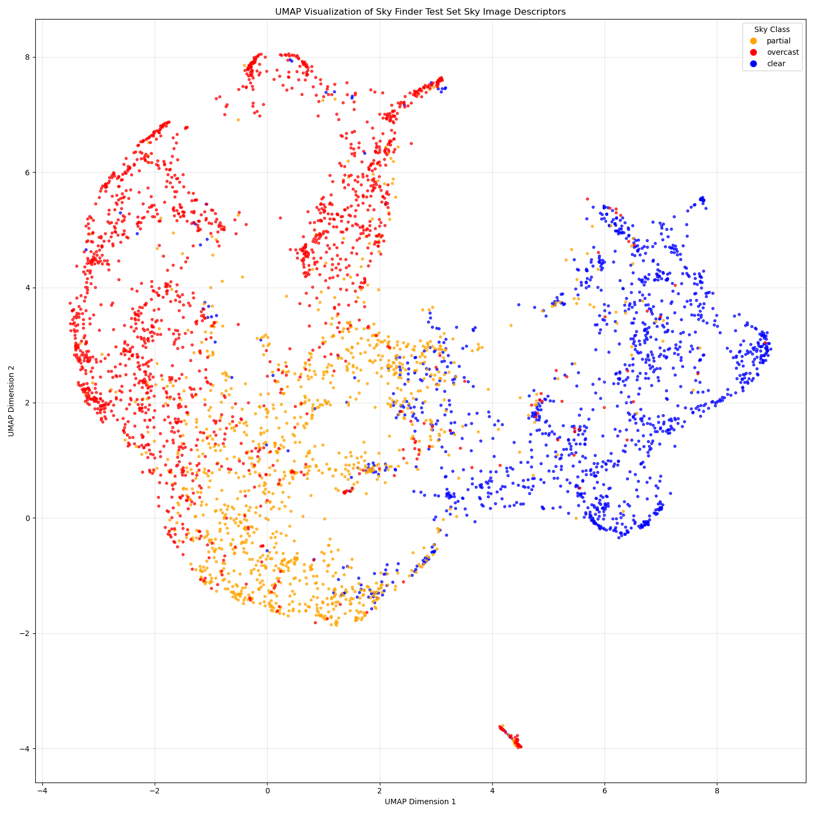
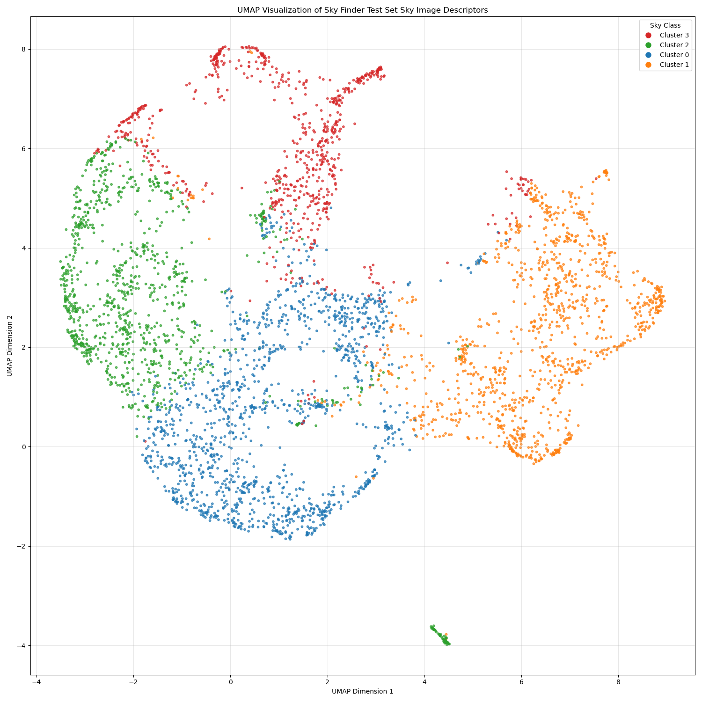
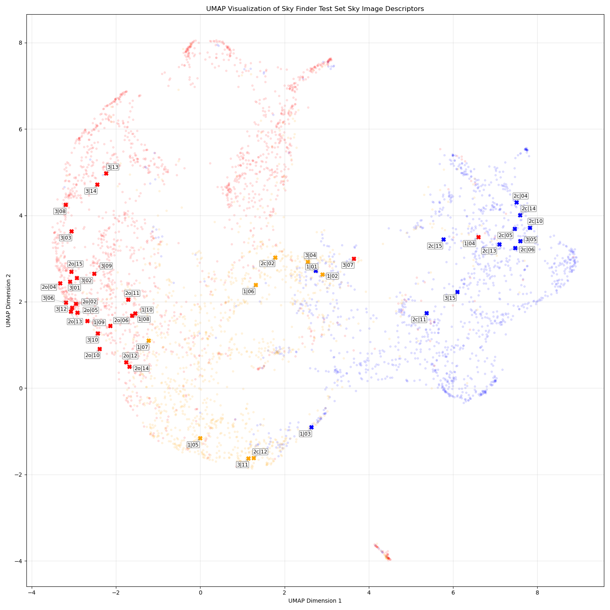
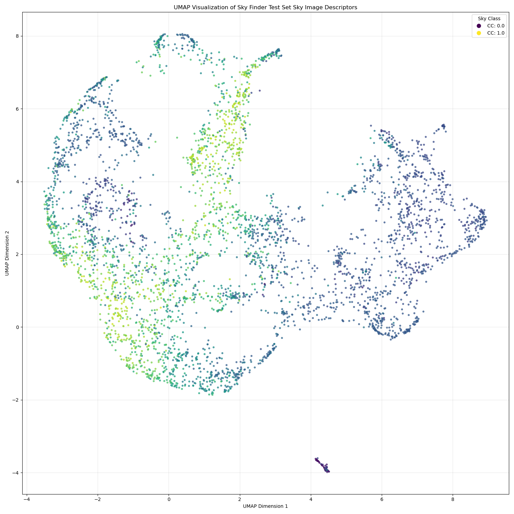
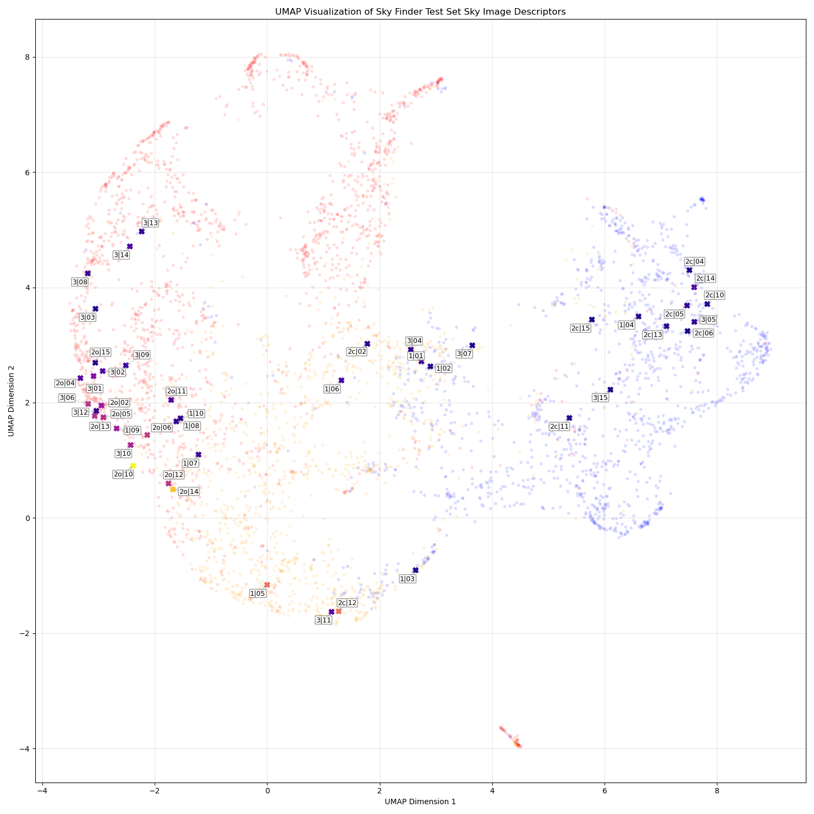

## -1. Introduction

## 0. Setup Instructions

## 1. Sky Image Descriptor

The sky image descriptor (SID) leverages the Sky Finder dataset [1], which contains a rich variety of sky imagery. We manually categorized the 20 most relevant scenes into three distinct classes: clear, partial, and overcast, based on sky conditions. Using this classified data, we trained a ResNet50 backbone [2] with a multi-layer perceptron head. The model was trained on a contrastive learning task, enabling it to extract meaningful sky image representations from the diverse sky conditions present in the dataset.


### 1.1 Datasets

#### 1.1.1 Sky Finder Dataset

The Sky Finder dataset comprises high-resolution outdoor images captured across various locations, weather conditions, and times of day. Our preprocessing involves:

1. **Image Classification**: We manually categorized the 20 most representative scenes in the dataset into three classes based on sky visibility, yielding 21,490 images across the three classes:
    - **Clear**: (6,335 images) Scenes with predominantly visible blue sky and minimal cloud coverage.
    - **Partial**: (6,378 images) Scenes with mixed cloud and clear sky regions.
    - **Overcast**: (8,777 images) Scenes with complete or near-complete cloud coverage.
2. **Image Preprocessing**: Images are cropped based on manually labeled ground segmentation to remove non-sky regions, and then in-painted using TELEA algorithm [3] with a radius of 3 pixels to seamlessly fill any artifacts along the segmentation boundary.

For experimental evaluation, the dataset is divided into training, validation, and test sets containing 12,894 (60%), 4,298 (20%), and 4,298 (20%) images, respectively.

#### 1.1.2 Pair Generation for Contrastive Learning

Our contrastive learning framework relies on creating meaningful sample pairs:

1. **Positive Pairs**: For each processed image in the dataset, we generate two different augmented views of the same base image. These views are created through a series of transformations aiming to keep the core content of the image intact while introducing variability.

2. **Negative Pairs**: All other augmented views from different base images in the batch serve as negative examples. The model learns to distinguish these from the positive pairs.

<div align="center">
    
    <div align="center">
    <em>Figure 1: Pair generation process for contrastive learning. Each original image is cropped to remove the ground region, inpainted and augmented to create two images, which are then used as positive pairs.</em>
    </div>
</div>


### 1.2 Model Architecture

#### 1.2.1 SID Backbone Network

The SID model employs a ResNet50 backbone pretrained on ImageNet [4] as the feature encoder, with the original classification head replaced by a projection head. The projection head consists of a two-layer multi-layer perceptron (MLP) with ReLU activation between layers, mapping the 2048-dimensional ResNet50 feature vector to a 16-dimensional SID space. The final descriptors are L2-normalized.

#### 1.2.2 Classification Head for Downstream Validation

To evaluate the quality of learned SID representations, we implement a simple classification head consisting of a 3-layer fully connected network. The architecture includes:

- **Input Layer**: Accepts 16-dimensional SID embeddings
- **Hidden Layers**: Two fully connected layers with ReLU activations.
- **Output Layer**: 3-way linear layer producing probabilities for clear, partial, and overcast sky conditions.

This lightweight classification head serves as a downstream task to validate that the learned SID representations capture semantically meaningful sky condition features.


### 1.3 Training Objective

#### 1.3.1 Contrastive Learning Objective

We employ the Normalized Temperature-scaled Cross Entropy (NT-Xent) loss, which is formulated as:

$$\mathcal{L} = -\log\frac{\exp(\text{sim}(z_i, z_j)/\tau)}{\sum_{k=1}^{2N}\mathbf{1}_{[k \neq i]}\exp(\text{sim}(z_i, z_k)/\tau)}$$

Where:
- $z_i$ and $z_j$ are normalized descriptors of two augmented views of the same image.
- $\text{sim}(u, v)$ denotes the cosine similarity between vectors $u$ and $v$.
- $\tau$ is a temperature parameter that controls the concentration level of the distribution.
- $N$ is the number of image pairs in the current batch.
- $\mathbf{1}_{[k \neq i]}$ is an indicator function that equals 1 when $k \neq i$.

This loss function encourages the model to learn representations where similar samples are pulled together in the descriptor space while dissimilar samples are pushed apart, resulting in a model that effectively captures the distinctive characteristics of different sky conditions.

#### 1.3.2 Classification Head Training Objective

The classification head is trained using standard cross-entropy loss:

$$L_{cls} = -\sum_{i=1}^{C} y_i \log(\hat{y}_i)$$

Where $C=3$ represents the number of sky condition classes, $y_i$ is the ground truth label, and $\hat{y}_i$ is the predicted probability for class $i$. The classification head is trained separately after the SID backbone has been trained and frozen.


### 1.4 Training Procedure

#### 1.4.1 SID Backbone Training

Our SID model was trained with the following hyperparameters and configuration:

- **Optimizer**: AdamW with a learning rate of $10^{-4}$ and weight decay of $10^{-4}$.
- **Embedding Dimension**: 16 (latent space dimension at the end of the MLP head).
- **Batch Configuration**: 2 batches with 3 pairs per batch ($N=3$).
- **Training Duration**: 4 epochs.
- **Temperature Parameter**: 0.5 for the NT-Xent loss.
- **Learning Rate Scheduler**: Reduce learning rate on plateau with a patience of 1 epoch and a factor of 0.5.
- **Hardware**: Single NVIDIA RTX 3080 GPU with 10GB of memory.

#### 1.4.2 Classification Head Training

The classification head training follows a standard supervised learning approach:

- **Optimizer**: AdamW with a learning rate of $10^{-3}$ and weight decay of $10^{-4}$.
- **Batch Size**: 32 images.
- **Training Duration**: 100 epochs with early stopping based on validation loss.
- **Learning Rate Scheduler**: Reduce learning rate on plateau with a patience of 1 epoch and a factor of 0.5.

These configurations provide a good balance between performance and computational efficiency, allowing the models to learn meaningful representations while remaining trainable on consumer-grade hardware.


### 1.5 Results

#### 1.5.1 Sky Image Descriptor Space Visualization

The trained SID model is evaluated on the Sky Finder dataset, and the results are visualized using UMAP [5]. The resulting plots demonstrate how the model effectively clusters similar sky conditions together in the descriptor space.

Figure 2a shows the sky image descriptor space visualization grouped by semantic sky class labels (clear, partial, overcast), revealing natural clustering of similar sky conditions. Remarkably, when applying unsupervised K-means clustering to the same descriptor space (Figures 2b-c), the resulting clusters closely follow the boundaries of the semantic sky classes. This alignment between unsupervised clustering and human-interpretable labels demonstrates that the SID model has learned meaningful representations that capture real physical and visual patterns in sky conditions without requiring explicit supervision during the descriptor extraction phase.

The K-means clustering reveals distinct patterns that correspond to recognizable sky characteristics. The rightmost cluster (blue in K=3, orange in K=4) centers on clear sky conditions, capturing images with predominantly blue skies and minimal cloud coverage. The bottom-center cluster (green in K=3, blue in K=4) focuses mostly on partially cloudy conditions and highly textured overcast skies, encompassing a diverse range of sky patterns from delicate veil clouds and scattered cumulus formations to heavily cloudy skies with significant texture variation.

In the K=3 clustering (Figure 2b), the remaining cluster primarily contains overcast skies. However, the K=4 clustering (Figure 2c) reveals a more nuanced structure by splitting overcast conditions into two distinct subclusters. The green cluster (leftmost region) centers around heavily and uniformly overcast skies with minimal texture variation, representing completely cloud-covered conditions or fog. In contrast, the red cluster (topmost region) captures overcast skies with more visual texture and contrast, likely including scenes where sky partially penetrates through cloud layers or where cloud formations exhibit greater structural variation. This finer granularity suggests that the SID representations encode subtle but meaningful differences in cloud density, texture, and spatial patterns that align with human visual perception of sky conditions.

<div align="center">
  
  <br>
  <em><strong>Figure 2a:</strong> Sky image descriptor space visualization grouped by semantic sky class labels (clear, partial, overcast).</em>
</div>

<br>

<div align="center">
  <table>
      <tr>
          <td align="center">
              
              <br>
              <em><strong>Figure 2b:</strong> K-means clustering with K=3</em>
          </td>
          <td align="center">
              
              <br>
              <em><strong>Figure 2c:</strong> K-means clustering with K=4</em>
          </td>
      </tr>
  </table>
  <em><strong>Figure 2:</strong> UMAP visualization of the trained SID model on the Sky Finder dataset showing both semantic groupings and unsupervised clustering patterns in the sky image descriptor space.</em>
</div>

#### 1.5.2 Downstream Classification Performance

To quantitatively validate the quality of the learned SID representations, we evaluate their performance on the downstream task of sky condition classification. The 16-dimensional SID embeddings are fed into the classification head described in Section 1.2.2, and the model is trained to predict the three sky condition classes.

The classification results demonstrate good performance across all evaluation metrics. The SID representations achieve over 86% accuracy on the test set with minimal performance degradation between training and test splits, indicating strong generalization capabilities. The high F1 scores across all splits confirm that the learned representations capture discriminative features that enable accurate sky condition classification, providing quantitative validation of the semantic clustering patterns observed in the UMAP visualizations.

<div align="center">
   <em><strong>Table 1:</strong> Classification performance of the SID-based sky condition classifier. Results demonstrate high accuracy and F1 scores across all data splits, validating the quality of learned representations.</em>
</div>

<div align="center">

| Metric | Training | Validation | Test |
|--------|----------|------------|------|
| **Accuracy** | 0.8609 | 0.8616 | 0.8637 |
| **F1 Score** | 0.8584 | 0.8561 | 0.8590 |

</div>

Analysis of the confusion matrix reveals interesting patterns in per-class performance. The clear sky class achieves the highest F1 score (0.9040), followed by overcast conditions (0.8904), while partial sky conditions show the lowest performance (0.7826). This performance disparity likely stems from the inherently ambiguous nature of partial sky conditions, which represent a transitional state between clear and overcast skies. The non-binary characteristics of partial conditions create classification challenges at decision boundaries, where distinguishing between clear-partial or overcast-partial transitions becomes ambiguous. This finding aligns with the expected difficulty in categorizing intermediate sky states and highlights the model's stronger performance on more distinctive sky conditions with clearer visual characteristics.

### 1.6 Plotting New Data in the SID Space

The SID space was built on the sky finder dataset, but new sky images can be projected into the SID space using the trained SID model. This allows for the visualization of new sky images in the same descriptor space, enabling comparison between new images or between sky finder manually labelled images.

#### 1.6.1 Window View Dataset

Adapting our own dataset of window views introduced in [6], we can pass the images through the SID model to obtain their sky image descriptors. The window view dataset contains 45 high-resolution images captured from fifteen different locations across the EPFL campus in Switzerland between March and May 2023, encompassing a wide range of atmospheric conditions including clear, partial, and overcast skies.

The images were captured using a calibrated Canon EOS R5 DSLR camera with dual fisheye lens at 6K resolution (6144×3072 pixels), then converted to 180-degree equirectangular projection format. To ensure physically accurate window view representation, each scene was captured alongside a 1:10 scale model of an office room with horizontal aperture. The capture locations maintained a minimum 6-meter distance from moving objects and aimed for balanced visual composition with approximately 25% greenery and 40% sky-to-window ratio, following European Daylight Standard EN17037 criteria.

This dataset was originally developed for virtual reality research investigating how dynamic versus static window view representations affect visual perception and building occupant experience. When processed through our trained SID model, these real-world window view images provide valuable validation of the sky image descriptor space learned from the Sky Finder dataset, enabling evaluation of how the model generalizes to practical architectural viewing scenarios.

#### 1.6.2 Methodology

To project new sky images into the trained SID space, we developed a processing pipeline that ensures consistent representation with the Sky Finder dataset. The methodology follows these sequential steps:

1. **Manual Image Cropping:** For images containing specific viewing contexts (e.g., window views), manual cropping can be applied to focus on the desired region. This step utilizes manually annotated binary masks to define the region of interest, ensuring that only relevant content is analyzed while excluding irrelevant elements.

2. **Sky Region Detection and Cropping:** The sky region is automatically segmented using Grounded Segment Anything 2 (GSAM2) [7] with the keyword prompt "sky". This state-of-the-art segmentation model provides accurate and robust segmentation of sky regions in images, even under challenging conditions such as varying lighting or atmospheric effects, and it eliminates the need for manual annotation of new datasets. Following segmentation, the image is automatically cropped to the bounding box of the detected sky region, removing non-sky areas and focusing the analysis on the relevant atmospheric content.

3. **Boundary Artifact Removal:** The cropped sky region undergoes inpainting using the TELEA algorithm with a radius of 3 pixels. This step removes segmentation boundary artifacts and ensures smooth transitions at mask boundaries, preserving the integrity of the sky region while eliminating potential artifacts that could affect descriptor quality.

#### 1.6.3 Results

The projection of window view images into the trained SID space demonstrates successful generalization of the learned sky descriptors to real-world architectural viewing scenarios. Figure 3 shows the UMAP visualization where the 42 window view images (represented as crosses) are distributed throughout the descriptor space alongside the Sky Finder dataset points.

The window view images exhibit meaningful spatial distribution within the established sky condition clusters. Clear sky conditions from the window views (blue crosses) predominantly map to the rightmost region of the descriptor space, aligning with the clear sky cluster learned from the Sky Finder dataset. Partial sky conditions (orange crosses) distribute primarily in the central regions, overlapping with the mixed cloud and clear sky patterns identified during training. Overcast conditions (red crosses) cluster in the left portion of the space, corresponding to the heavily clouded regions established by the original training data.

<div align="center">
  
  <br>
  <em><strong>Figure 3:</strong> Sky image descriptor space visualization with new window view images projected into the SID space. The new images are represented as crosses, with colors indicating their estimated sky condition class (blue for clear, orange for partial and red for overcast).</em>
</div>

### 1.7 Reproduction Procedure

Follow these steps to reproduce our SID results by generating the dataset, training the model and plotting the SID space.

#### 1.7.1 Sky Finder Dataset Generation

To prepare the dataset for training, execute the following commands which will download and organize the Sky Finder images according to our classification schema:

```bash
cd src/datasets
python generate_sky_finder_dataset.py [-w <max-workers>] [-f] [-r]
```

**Parameters:**
- `-w`, `--max-workers`: (Optional, default: 3) Specifies the maximum number of concurrent workers for downloading images. Higher values speed up the download process but require more system resources.
- `-f`, `--force`: (Optional, default: false) Forces re-download, re-extraction, re-classification, and re-splitting of data even if it already exists locally, ensuring you have the latest version.
- `-r`, `--remove-data`: (Optional, default: false) Automatically removes temporary archives and extracted data after processing (keeps final split data) to save disk space.

#### 1.7.2 Training the SID Model

To train the SID model, execute the following commands:

```bash
cd src/contrastive_net
python contrastive_net_train.py [-e <epochs>] [-b <batch-size>] [-w <workers>] [-evaluation-steps <evaluation-steps>] [--learning-rate <learning-rate>] [--weight-decay <weight-decay>] [--project-name <project-name>] [--experiment-name <experiment-name>] [--accelerator <accelerator>] [--devices <devices>] [--precision <precision>] [--save-top-k <save-top-k>] [--no-pretrained] [--no-normalize]
```

**Parameters:**
- `-e`, `--epochs`: (Optional, default: 4) Number of training epochs.
- `-b`, `--batch-size`: (Optional, default: 2) Batch size for training.
- `-w`, `--n-workers`: (Optional, default: 8) Number of data loading workers.
- `--evaluation-steps`: (Optional, default: 500) Number of steps between validation runs.
- `--learning-rate`: (Optional, default: 1e-4) Learning rate for optimization.
- `--weight-decay`: (Optional, default: 1e-4) Weight decay for regularization.
- `--project-name`: (Optional, default: "lipid") W&B project name.
- `--experiment-name`: (Optional, default: auto-generated timestamp) Custom experiment name.
- `--accelerator`: (Optional, default: "gpu") Hardware accelerator to use (cpu/gpu/tpu).
- `--devices`: (Optional, default: -1) Number of devices to use (-1 for all available).
- `--precision`: (Optional, default: 32) Training precision (16/32).
- `--save-top-k`: (Optional, default: 3) Number of best checkpoints to save.
- `--no-pretrained`: (Optional, default: false) Use randomly initialized backbone instead of pretrained.
- `--no-normalize`: (Optional, default: false) Disable embedding normalization.

Model weights will be saved in the `data/models/contrastive_net` directory. If you want to use your own model for further steps, manually rename and move the best checkpoint to `data/models/contrastive_net/baseline.ckpt`.

#### 1.7.3 Generating Sky Finder Descriptors

To generate the descriptors for the Sky Finder dataset, execute the following commands:

```bash
cd src/pipeline
python generate_sky_finder_descriptors.py [-w <workers>] [-f]
```

**Parameters:**
- `-w`, `--n-workers`: (Optional, default: 1) Number of workers for data loading.
- `-f`, `--force`: (Optional, default: false) Force overwrite existing descriptor file.

The generated descriptors will be saved in the [generated/sky_finder_descriptors.json](generated/sky_finder_descriptors.json) file.

#### 1.7.4 Plotting the SID Space

To plot the SID space and visualize the results, execute the following commands:

```bash
cd src/pipeline
python plot_sky_image_descriptor_space.py [-c <color-by>] [-k <n-clusters>] [-i <interactive>]
```

**Parameters:**
- `-c`, `--color-by`: (Optional, default is `sky_type`) Specifies the grouping type for the plot. Options include `sky_type` (default), `cluster` and `cloud_cover`, which groups the descriptors by their sky condition type or by clustering them into $k$ clusters or by cloud coverage percentage, respectively.
- `-k`, `--n-clusters`: (Optional, default is 3) Specifies the number of clusters to use when grouping by cluster type. This parameter is only relevant when `--color-by` is set to `cluster`.
- `-i`, `--interactive`: (Optional, default is false) Enables interactive mode for the plot, allowing you to hover over points to see images.


#### 1.7.5 Training and Evaluating the Classification Head

To train the classification head and evaluate the downstream classification performance:

```bash
cd src/sky_class_net
python sky_class_train.py [-e <epochs>] [-b <batch-size>] [-w <workers>] [--evaluation-steps <evaluation-steps>] [--learning-rate <learning-rate>] [--weight-decay <weight-decay>] [--dropout-rate <dropout-rate>] [--project-name <project-name>] [--experiment-name <experiment-name>] [--accelerator <accelerator>] [--devices <devices>] [--precision <precision>] [--save-top-k <save-top-k>]
```

**Parameters:**
- `-e`, `--epochs`: (Optional, default: 100) Number of training epochs.
- `-b`, `--batch-size`: (Optional, default: 32) Batch size for training.
- `-w`, `--n-workers`: (Optional, default: 1) Number of data loading workers.
- `--evaluation-steps`: (Optional, default: 100) Number of steps between validation runs.
- `--learning-rate`: (Optional, default: 1e-3) Learning rate for optimization.
- `--weight-decay`: (Optional, default: 1e-4) Weight decay for regularization.
- `--dropout-rate`: (Optional, default: 0.0) Dropout rate for regularization.
- `--project-name`: (Optional, default: "lipid") W&B project name.
- `--experiment-name`: (Optional, default: auto-generated timestamp) Custom experiment name.
- `--accelerator`: (Optional, default: "gpu") Hardware accelerator to use (cpu/gpu/tpu).
- `--devices`: (Optional, default: -1) Number of devices to use (-1 for all available).
- `--precision`: (Optional, default: 32) Training precision (16/32).
- `--save-top-k`: (Optional, default: 3) Number of best checkpoints to save.

Model weights will be saved in the `data/models/sky_class_net` directory. If you want to use your own model for further steps, manually rename and move the best checkpoint to `data/models/sky_class_net/baseline.ckpt`. To evaluate the trained classification model:

```bash
cd src/sky_class_net
python sky_class_eval.py
```

The classification results will demonstrate the effectiveness of the learned SID representations for downstream sky condition classification tasks, producing the performance metrics shown in Table 1 of Section 1.5.2.

#### 1.7.6 Plotting New Data in the SID Space

To project new sky videos into the SID space, follow these steps:

1. **Prepare the new video dataset**: Ensure the new sky videos are in a compatible format (e.g., MP4, AVI, MOV, MKV) and stored in the [data/videos/processed](data/videos/processed) directory. The videos should contain visible sky regions for accurate descriptor extraction.

2. **Preparte the manually annotated masks**: If you have manually annotated masks for the new videos, place them in the [data/videos/masks](data/videos/masks) directory. This step is optional, typically used for datasets where specific regions of interest need to be focused on.

3. **Run the projection script**: Execute the following command to process the new videos and project them into the SID space:

    ```bash
    cd src/pipeline
    python run_pipeline [-vp <video-path>] [-mp <mask-path>] [-fr <frame-rate>] [-w <workers>] [-sam2 <sam2-type>] [-gdino <gdino-type>] [-bt <box-threshold>] [-tt <text-threshold>] [-sp] [-f]
    ```

    **Parameters:**
    - `-vp`, `--video-path`: Path to the video file.
    - `-mp`, `--mask-path`: (Optional) Path to the manually annotated mask file. If provided, the script will use this mask to focus on specific regions of interest.
    - `-fr`, `--frame-rate`: (Optional, default: 1/3) Frame rate for processing the video. Higher values will extract more frames but require more processing time.
    - `-sam2`, `--sam2-type`: (Optional, default: "large") Type of SAM2 model to use for segmentation. Options include "large", "medium", and "base" or "small".
    - `-gdino`, `--gdino-type`: (Optional, default: "tiny") Type of G-DINO model to use for segmentation. Options include "tiny" or "base".
    - `-bt`, `--box-threshold`: (Optional, default: 0.35) Box threshold for SAM2 segmentation.
    - `-tt`, `--text-threshold`: (Optional, default: 0.35) Text threshold for SAM2 segmentation.
    - `-sp`, `--show-plots`: (Optional, default: false) If set, displays the generated plots for the projected SID space.
    - `-f`, `--force`: (Optional, default: false) Forces reprocessing of the video even if the descriptors already exist.

4. **Plot the SID space**: After processing the new videos, you can visualize the projected descriptors in the SID space by executing:

    ```bash
    cd src/pipeline
    python plot_pipeline.py [-vp <video-path>] [-pt]
    ```

    **Parameters:**
    - `-vp`, `--video-path`: Path to the video file.
    - `-pt`, `--plot-time`: (Optional, default: false) If set, plots the descriptors over time, showing how the SID space evolves throughout the video.

    Or simply run the following command to plot all the generated descriptors in the SID space:

    ```bash
    cd src/pipeline
    python plot_pipeline_all.py -c sky_type [-p <pipeline-path>]
    ```

    **Parameters:**
    - `-p`, `--pipeline-path`: (Optional, default: [generated/pipeline](generated/pipeline)) Path to the directory containing the generated descriptors.


## 2. Cloud Coverage

The cloud coverage (CC) model provides a quantitative measure of sky conditions through pixel-level segmentation and aggregation. Using a U-Net architecture with a ResNet50 encoder backbone, the model performs dense prediction to estimate the proportion of cloud coverage for each sky pixel, outputting probability values between 0 and 1. The final cloud coverage percentage is computed by taking the spatial average of all sky pixel predictions, resulting in a single continuous value representing the overall cloud coverage for the entire sky region.


### 2.1 Datasets

#### 2.1.1 Sky Finder Cover Dataset

In this repository, we introduce the Sky Finder Cover Dataset, which is a manually annotated subset of the Sky Finder Dataset with pixel-level cloud segmentation masks. This carefully curated dataset maintains the same classification schema (clear, partial, and overcast) as the original Sky Finder Dataset, providing high-quality ground truth for cloud segmentation tasks.

The dataset was created through a meticulous annotation process where representative images were selected from each sky condition category to ensure diversity across weather conditions, times of day, and cloud formations. Annotators then created pixel-precise masks, where each pixel is labeled as either cloud-covered (white), partially covered (gray) or clear sky/ground (black). Special attention was given to cloud boundaries and transitional regions to ensure accurate coverage estimation.

For experimental evaluation, the dataset was divided into training and validation sets containing 182 and 58 images, respectively, maintaining representative distributions across all sky condition classes.

#### 2.1.2 Sky Finder Active Dataset

To address the limited size of manually annotated data, we implement an active learning framework that leverages high-confidence pseudo-labels from the broader Sky Finder dataset.

A cloud coverage model was first trained on the manually annotated Sky Finder Cover Dataset using the architecture and training procedure described in Sections 2.2 and 2.4. The trained model was then systematically applied to unlabeled images from the full Sky Finder Dataset, where prediction uncertainty was quantified using pixel-wise entropy measurements across the segmentation output. Through this uncertainty quantification process, only predictions exhibiting low entropy were selected as pseudo-labels, ensuring quality control through confidence-based filtering. This threshold-based selection mechanism effectively retained only the most confident predictions for training augmentation, maintaining annotation quality while significantly expanding the available training data.

This active learning approach expands the training set with 359 high-confidence pseudo-labeled images and the validation set with 128 additional pseudo-labeled images, significantly increasing the available training data while maintaining annotation quality through automated confidence filtering.


### 2.2 Model Architecture

The CC model employs a U-Net [8] architecture with a ResNet50 backbone pretrained on ImageNet serving as the feature encoder. This encoder-decoder structure is specifically designed for dense prediction tasks, making it well-suited for pixel-level cloud segmentation.

**Encoder (ResNet50 Backbone):** The ResNet50 encoder progressively downsamples input images while extracting hierarchical features at multiple scales. The pretrained weights provide robust low-level feature representations that transfer effectively to sky imagery, capturing edges, textures, and structural patterns essential for cloud boundary detection.

**Decoder with Skip Connections:** The decoder consists of upsampling blocks that progressively restore spatial resolution through bilinear interpolation followed by convolutional layers. Skip connections from corresponding encoder levels are concatenated with decoder features at each resolution level, preserving fine-grained spatial information essential for accurate cloud boundary delineation.

**Dual-Output Design:** The architecture incorporates two complementary outputs to enhance learning:
1. **Primary Segmentation Output:** Pixel-wise cloud coverage estimation through the standard U-Net segmentation head, producing a probability map where each pixel represents the likelihood of cloud coverage.

2. **Auxiliary Classification Branch:** A secondary convolutional branch processes feature maps before the final segmentation layer to output a single scalar value between 0 and 1, representing overall sky condition intensity (0 for clear, 0.5 for partial, 1 for overcast).

This auxiliary branch provides additional supervisory signal during training, enables evaluation of global sky classification accuracy, and enforces consistency between pixel-level predictions and image-level sky conditions, resulting in more robust and interpretable cloud coverage estimates.


### 2.3 Training Objective

The training objective combines three complementary loss functions to optimize both segmentation accuracy and classification consistency:

$$\mathcal{L} = 0.5 \cdot \mathcal{L}\_{F} + 0.5 \cdot \mathcal{L}\_{D} + 0.1 \cdot \mathcal{L}\_{B}$$

The focal loss ($\mathcal{L}_{F}$) addresses class imbalance and focuses learning on difficult examples:

$$\mathcal{L}_{F} = -\alpha(1-p_t)^\gamma\log(p_t)$$

Where $p_t$ is the predicted probability for the true class, $\alpha=0.5$ balances class importance, and $\gamma=2.0$ down-weights easy examples, forcing the model to focus on challenging cloud boundaries and ambiguous regions.

The dice loss ($\mathcal{L}_{D}$) optimizes spatial overlap between predicted and ground truth segmentations:

$$\mathcal{L}\_{D} = 1 - \frac{2\sum\_{i=1}^{N}p_i g_i}{\sum\_{i=1}^{N}p_i^2 + \sum\_{i=1}^{N}g_i^2 + \epsilon}$$

Where $p_i$ and $g_i$ are predicted and ground truth probabilities for pixel $i$, $N$ is the total number of pixels, and $\epsilon$ ensures numerical stability. This loss is particularly effective for segmentation tasks as it directly optimizes the overlap metric used for evaluation.

For the auxiliary classification branch, binary cross-entropy loss ($\mathcal{L}_{\text{BCE}}$) provides supervision using image-level sky condition labels:

$$\mathcal{L}_{B} = -[y \log(\hat{y}) + (1-y) \log(1-\hat{y})]$$

Where $y$ is the ground truth sky condition class and $\hat{y}$ is the predicted classification score. This ensures consistency between pixel-level and image-level predictions.


### 2.4 Training Procedure

The cloud coverage model was trained using a two-stage approach to leverage both manually annotated and pseudo-labeled data effectively:

#### 2.4.1 Manual Labels Only:

- **Optimizer:** AdamW with learning rate $10^{-4}$ and weight decay $10^{-4}$.
- **Batch Size:** 2 images per batch.
- **Training Duration:** 100 epochs.
- **Learning Rate Scheduler:** Reduce on plateau with patience of 1 epoch and factor of 0.5.

#### 2.4.2 Active Learning Enhancement:

- **Initialization:** Best checkpoint from Stage 1.
- **Additional Data:** 359 pseudo-labeled training images, 128 pseudo-labeled validation images.
- **Optimizer:** AdamW with learning rate $10^{-4}$ and weight decay $10^{-4}$.
- **Batch Size:** 2 images per batch.
- **Training Duration:** 50 additional epochs with early stopping based on validation loss.
- **Learning Rate Scheduler:** Reduce on plateau with patience of 1 epoch and factor of 0.5.

**Hardware Configuration:** Training was conducted on a single NVIDIA RTX 3080 GPU with 10GB memory, enabling efficient processing of high-resolution sky images while maintaining reasonable training times.


### 2.5 Results

#### 2.5.1 Quantitative Performance Analysis

The cloud coverage model demonstrates strong performance across multiple evaluation metrics, with the active learning approach showing consistent improvements over the baseline model trained solely on manual annotations. The active learning enhanced model demonstrates superior performance across all metrics, with IoU improvements ranging from 2.7% to 7.1% depending on the validation set composition. The best configuration achieves a mean absolute coverage error of 8.24%, representing good accuracy in quantitative cloud coverage estimation across diverse sky conditions.

<div align="center">
   <em><strong>Table 2:</strong> Comprehensive performance comparison across training and validation configurations. Coverage Error represents the mean absolute percentage error in estimating cloud coverage. Sky Class Error represents the classification error rate for three-class sky condition categorization.</em>
</div>

<div align="center">

| Training Data | Validation Data | IoU | Dice Score | Coverage Error | Sky Class Error |
|---------------|-----------------|-----|------------|----------------|-----------------|
| Manual Labels Only | Manual Validation | 0.3632 | 0.4605 | 0.1380 | 0.2472 |
| Manual Labels Only | Manual + Pseudo Validation | 0.3697 | 0.4665 | 0.0927 | 0.2840 |
| Manual + Pseudo Labels | Manual Validation | 0.3905 | 0.4825 | 0.1365 | 0.2107 |
| Manual + Pseudo Labels | Manual + Pseudo Validation | **0.4408** | **0.5217** | **0.0824** | **0.2114** |

</div>

#### 2.5.2 SID Space Visualization with Cloud Coverage

To understand the relationship between learned sky representations and cloud coverage estimates, we visualized the Sky Image Descriptor (SID) space colored by predicted cloud coverage values. This analysis reveals important insights about model performance and limitations.

<div align="center">
  
  <br>
  <em><strong>Figure 4:</strong> UMAP visualization of the Sky Image Descriptor space colored by predicted cloud coverage values. Dark blue represents clear skies (low coverage), while yellow represents overcast conditions (high coverage).</em>
</div>

The visualization demonstrates clear performance patterns across different sky conditions, with the model performing exceptionally well for clear sky conditions in the rightmost cluster, consistently predicting low cloud coverage values (dark blue) that align with ground truth expectations. Moving toward more complex conditions, overcast skies with significant visual texture and structure in the upper center regions show successful high cloud coverage identification, while the central regions exhibit smooth gradations in cloud coverage estimates that effectively capture the transitional nature of partial sky conditions with appropriate intermediate values. However, a critical limitation emerges in the leftmost cluster, where uniform overcast skies with minimal texture variation display inconsistent cloud coverage predictions, showing a problematic tendency to estimate low coverage values (dark blue) despite representing heavily clouded conditions that should yield consistently high coverage estimates.

The observed performance disparity in uniform overcast conditions can be attributed to several fundamental challenges that highlight the inherent limitations of sky-only analysis. During manual annotation, human annotators naturally incorporated contextual cues from ground regions to assess sky conditions, utilizing ground shadows, ambient lighting conditions, and overall scene brightness as critical indicators of atmospheric conditions that are completely unavailable when analyzing isolated sky regions. This information loss is compounded by the model's inherent texture dependency, as uniform overcast skies often lack the distinctive structural features and spatial variation patterns that the model relies upon for accurate segmentation. Furthermore, lighting ambiguity creates additional classification challenges, as uniform conditions encompass a wide spectrum of scenarios ranging from bright days with thin, diffuse cloud cover to dark, heavily clouded conditions that can appear visually similar despite representing vastly different levels of actual cloud density and coverage.


### 2.6 Reproduction Procedure

#### 2.6.1 Training and Evaluating the CC Model

To train the cloud coverage model and evaluate its performance:

```bash
cd src/unet
python unet_train.py [-e <epochs>] [-b <batch-size>] [-w <workers>] [--evaluation-steps <evaluation-steps>] [--learning-rate <learning-rate>] [--weight-decay <weight-decay>] [--bottleneck-dropout <bottleneck-dropout>] [--decoder-dropout <decoder-dropout>] [--project-name <project-name>] [--experiment-name <experiment-name>] [--accelerator <accelerator>] [--devices <devices>] [--precision <precision>] [--save-top-k <save-top-k>] [-a] [--no-pretrained]
```

**Parameters:**
- `-e`, `--epochs`: (Optional, default: 100) Number of training epochs.
- `-b`, `--batch-size`: (Optional, default: 2) Batch size for training.
- `-w`, `--n-workers`: (Optional, default: 8) Number of data loading workers.
- `--evaluation-steps`: (Optional, default: 40) Number of steps between validation runs.
- `--learning-rate`: (Optional, default: 1e-4) Learning rate for optimization.
- `--weight-decay`: (Optional, default: 1e-4) Weight decay for regularization.
- `--bottleneck-dropout`: (Optional, default: 0.0) Dropout rate for bottleneck layer.
- `--decoder-dropout`: (Optional, default: 0.0) Dropout rate for decoder layers.
- `--project-name`: (Optional, default: "lipid") W&B project name.
- `--experiment-name`: (Optional, default: auto-generated timestamp) Custom experiment name.
- `--accelerator`: (Optional, default: "gpu") Hardware accelerator to use (cpu/gpu/tpu).
- `--devices`: (Optional, default: -1) Number of devices to use (-1 for all available).
- `--precision`: (Optional, default: 32) Training precision (16/32).
- `--save-top-k`: (Optional, default: 3) Number of best checkpoints to save.
- `-a`, `--active`: (Optional) Use active learning with pseudo-labelling.
- `--no-pretrained`: (Optional) Use randomly initialized backbone instead of pretrained.

Model weights will be saved in the `data/models/unet` directory. If you want to use your own model for further steps, manually rename and move the best checkpoint to `data/models/unet/baseline_manual.ckpt` (for manual training) or `data/models/unet/baseline_active.ckpt` (for active learning). To evaluate the trained cloud coverage model:

```bash
cd src/unet
python unet_eval.py [--active] [--with-pseudo-labelling]
```

The evaluation results will demonstrate the model's effectiveness at pixel-level cloud segmentation and coverage estimation, providing continuous IoU, Dice coefficient, coverage error, and sky class prediction metrics.

#### 2.6.2 Generating Sky Finder Descriptors

If not already done, generate the descriptors for the Sky Finder dataset by executing the following commands:

```bash
cd src/pipeline
python generate_sky_finder_descriptors.py [-w <workers>] [-f]
```

**Parameters:**
- `-w`, `--n-workers`: (Optional, default: 1) Number of workers for data loading.
- `-f`, `--force`: (Optional, default: false) Force overwrite existing descriptor file.

The generated descriptors will be saved in the [generated/sky_finder_descriptors.json](generated/sky_finder_descriptors.json) file.

#### 2.6.3 Plotting the SID Space with Cloud Coverage

cd src/pipeline
python .\plot_sky_image_descriptor_space.py -c cloud_cover

```bash
cd src/pipeline
python plot_sky_image_descriptor_space.py color [-i <interactive>]
```

**Parameters:**
- `-i`, `--interactive`: (Optional, default is false) Enables interactive mode for the plot, allowing you to hover over points to see images.


## 3. Optical Flow

Optical flow analysis captures the dynamic characteristics of sky conditions by quantifying pixel-level motion patterns between consecutive video frames. This temporal descriptor provides insights into cloud movement, atmospheric dynamics, and weather transitions that are impossible to capture from static images alone, serving as a complementary feature to the appearance-based Sky Image Descriptors.


### 3.1 Methodology

We employ the Farneback optical flow algorithm implemented in OpenCV to compute dense optical flow fields between consecutive frames sampled at 3-second intervals in sky videos. The Farneback method estimates motion by analyzing the displacement of intensity patterns between frames, making it well-suited for capturing cloud movement and atmospheric dynamics without requiring feature tracking.

For each video sequence, we extract the mean optical flow magnitude across all sky pixels as the primary temporal descriptor, providing a single scalar value that quantifies the overall motion intensity in the sky region.


### 3.2 Results

#### 3.2.1 Optical Flow Magnitude in SID Space

To understand the relationship between sky appearance and motion characteristics, we Figure 5 shows the SID space colored by optical flow magnitude values from our 45 window view scenes. This analysis reveals the distribution of motion patterns across different sky conditions and their correspondence with the learned appearance representations.

<div align="center">
  
  <br>
  <em><strong>Figure 5:</strong> UMAP visualization of the Sky Image Descriptor space colored by optical flow magnitude. Dark blue represents low motion (static conditions at 0 mean optical flow magnitude value), while yellow represents high motion (dynamic cloud movement at 1.43 mean optical flow magnitude value).</em>
  ).</em>
</div>

The visualization reveals clear trends in optical flow magnitude distribution across the SID space that align with the physical characteristics of different sky conditions. Clear skies in the rightmost cluster typically exhibit low optical flow values (dark blue), as these uniform conditions lack moving visual features that would generate significant motion patterns. Similarly, the upper left region of the SID space, which corresponds to uniform overcast and foggy conditions as identified in previous analysis, also shows predominantly low optical flow magnitudes due to the homogeneous, static nature of these atmospheric conditions. In contrast, the highest optical flow magnitudes appear in regions corresponding to overcast and partial sky conditions with higher visual contrast, where distinct cloud formations create clearly differentiated patterns against the sky background. These structured cloud environments generate substantial motion patterns as cloud formations move across the sky due to wind and changing atmospheric conditions, resulting in the elevated optical flow values observed in these intermediate regions of the SID space.

### 3.3 Reproduction Procedure

#### 3.6.1 Generating Sky Finder Descriptors

If not already done, generate the descriptors for the Sky Finder dataset by executing the following commands:

```bash
cd src/pipeline
python generate_sky_finder_descriptors.py [-w <workers>] [-f]
```

**Parameters:**
- `-w`, `--n-workers`: (Optional, default: 1) Number of workers for data loading.
- `-f`, `--force`: (Optional, default: false) Force overwrite existing descriptor file.

The generated descriptors will be saved in the [generated/sky_finder_descriptors.json](generated/sky_finder_descriptors.json) file.

#### 3.6.2 Generating Scene Descriptors

### 3.6.3 Plotting the SID Space with New Data Optical Flow


python plot_pipeline_all.py -c optical_flow [-p <pipeline-path>]

**Parameters:**
    - `-p`, `--pipeline-path`: (Optional, default: [generated/pipeline](generated/pipeline)) Path to the directory containing the generated descriptors.


## References

[1] Mihail et al., "Sky Finder: A Segmentation Benchmark for Sky Regions in the Wild," IEEE/CVF Winter Conference on Applications of Computer Vision (WACV), 2016.

[2] He et al., "Deep Residual Learning for Image Recognition," IEEE Conference on Computer Vision and Pattern Recognition (CVPR), 2016.

[3] Telea, A., "An Image Inpainting Technique Based on the Fast Marching Method," Journal of Graphics Tools, Vol. 9, No. 1, 2004.

[4] Deng, J., Dong, W., Socher, R., Li, L.-J., Li, K., and Fei-Fei, L., "ImageNet: A Large-Scale Hierarchical Image Database," IEEE Conference on Computer Vision and Pattern Recognition (CVPR), 2009, pp. 248-255.

[5] McInnes, L., Healy, J., and Melville, J., "UMAP: Uniform Manifold Approximation and Projection for Dimension Reduction," arXiv preprint arXiv:1802.03426, 2018.

[6] Cho, Y., Karmann, C., and Andersen, M., "Perception of window views in VR: Impact of display and type of motion on subjective and physiological responses," Building and Environment, Vol. 274, 2025, 112757. https://doi.org/10.1016/j.buildenv.2025.112757

[7] Ren, T., Liu, S., Zeng, A., Lin, J., Li, K., Cao, H., Chen, J., Huang, X., Chen, Y., Yan, F., Zeng, Z., Zhang, H., Li, F., Yang, J., Li, H., Jiang, Q., and Zhang, L., "Grounded SAM: Assembling Open-World Models for Diverse Visual Tasks," arXiv preprint arXiv:2401.14159, 2024.

[8] Ronneberger, O., Fischer, P., and Brox, T., "U-Net: Convolutional Networks for Biomedical Image Segmentation," International Conference on Medical Image Computing and Computer-Assisted Intervention (MICCAI), Lecture Notes in Computer Science, Vol. 9351, Springer, 2015, pp. 234-241.
