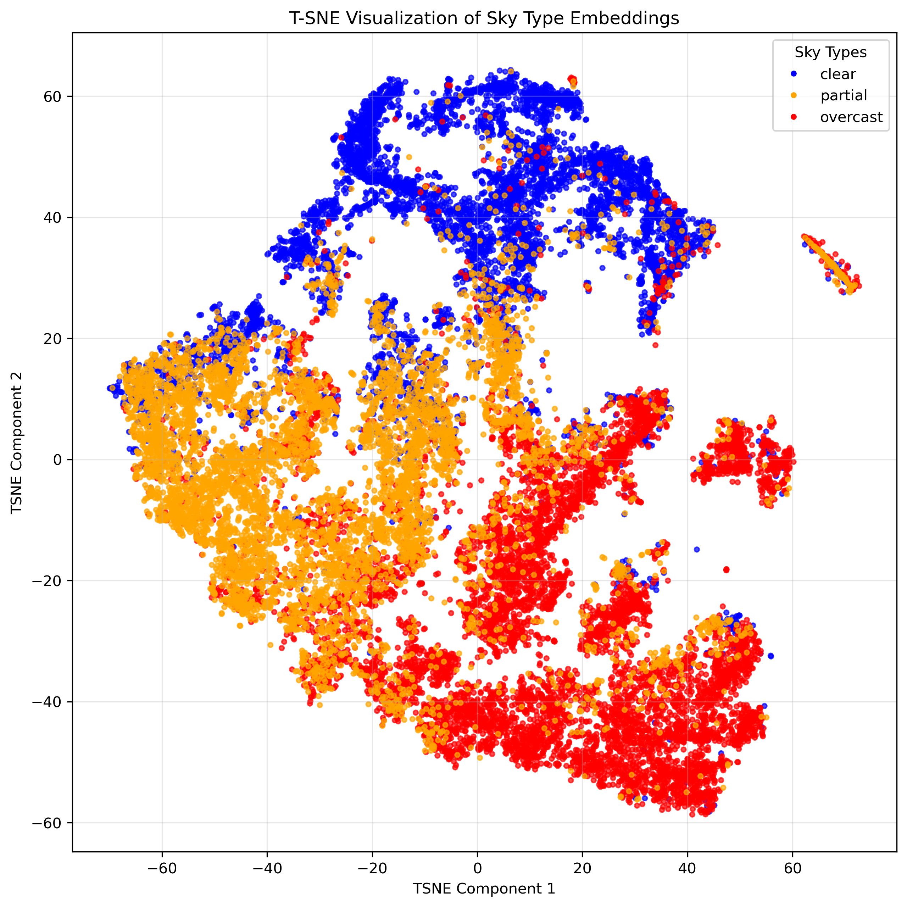

## 1. Texture Descriptor

The texture descriptor leverages the Sky Finder dataset [1], which contains a rich variety of sky imagery. We categorized the 20 most relevant scenes into three distinct classes: clear, partial, and overcast, based on sky conditions. Using this classified data, we trained a ResNet50 backbone [2] with a multi-layer perceptron head. The model was trained on a contrastive learning task, enabling it to extract meaningful texture representations from the diverse sky conditions present in the dataset.


### 1.1 Dataset

#### 1.1.1 Sky Finder Dataset

The Sky Finder dataset comprises high-resolution outdoor images captured across various locations, weather conditions, and times of day. Our preprocessing involves:

1. **Image Classification**: We manually categorized the 20 most representative scenes in the dataset into three classes based on sky visibility, yielding 21,490 images across the three classes:
    - **Clear**: (6,335 images) Scenes with predominantly visible blue sky and minimal cloud coverage.
    - **Partial**: (6,378 images) Scenes with mixed cloud and clear sky regions.
    - **Overcast**: (8,777 images) Scenes with complete or near-complete cloud coverage.
2. **Image Preprocessing**: Images are cropped based on manually labeled ground segmentation to remove non-sky regions, and then in-painted using TELEA algorithm [3] with a radius of 3 pixels to seamlessly fill any artifacts along the segmentation boundary.

For experimental evaluation, the dataset is divided into training, validation, and test sets containing 12,894 (60%), 4,298 (20%), and 4,298 (20%) images, respectively.

#### 1.1.2 Pair Generation for Contrastive Learning

Our contrastive learning framework relies on creating meaningful sample pairs:

1. **Positive Pairs**: For each processed image in the dataset, we generate two different augmented views of the same base image. These views are created through a series of transformations aiming to keep the core content of the image intact while introducing variability.

2. **Negative Pairs**: All other augmented views from different base images in the batch serve as negative examples. The model learns to distinguish these from the positive pairs.

<div align="center">
    
    <div align="center">
    <em>Figure 1: Pair generation process for contrastive learning. Each original image is cropped to remove the ground region, inpainted and augmented to create two images, which are then used as positive pairs.</em>
    </div>
</div>


### 1.2 Model Architecture


### 1.3 Training Objective

We employ the Normalized Temperature-scaled Cross Entropy (NT-Xent) loss, which is formulated as:

$$L = -\log\frac{\exp(\text{sim}(z_i, z_j)/\tau)}{\sum_{k=1}^{2N}\mathbf{1}_{[k \neq i]}\exp(\text{sim}(z_i, z_k)/\tau)}$$

Where:
- $z_i$ and $z_j$ are normalized embeddings of two augmented views of the same image.
- $\text{sim}(u, v)$ denotes the cosine similarity between vectors $u$ and $v$.
- $\tau$ is a temperature parameter that controls the concentration level of the distribution.
- $N$ is the number of image pairs in the current batch.
- $\mathbf{1}_{[k \neq i]}$ is an indicator function that equals 1 when $k \neq i$.

This loss function encourages the model to learn representations where similar samples are pulled together in the embedding space while dissimilar samples are pushed apart, resulting in a texture descriptor that effectively captures the distinctive characteristics of different sky conditions.


### 1.4 Training Procedure

Our texture descriptor model was trained with the following hyperparameters and configuration:

- **Optimizer**: AdamW with a learning rate of $10^{-3}$ and weight decay of $10^{-4}$.
- **Embedding Dimension**: 16 (latent space dimension at the end of the MLP head).
- **Batch Configuration**: 2 batches with 3 pairs per batch ($N=3$).
- **Training Duration**: 4 epochs.
- **Temperature Parameter**: 0.5 for the NT-Xent loss.
- **Learning Rate Scheduler**: Reduce learning rate on plateau with a patience of 1 epoch and a factor of 0.5.
- **Hardware**: Single NVIDIA RTX 3080 GPU with 10GB of memory.

This configuration provides a good balance between performance and computational efficiency, allowing the model to learn meaningful texture representations while remaining trainable on consumer-grade hardware.


### 1.5 Results

The trained texture descriptor model is evaluated on the Sky Finder dataset, and the results are visualized using t-SNE [4]. The resulting plot illustrates how the model effectively clusters similar sky conditions together in the embedding space.
<div align="center">
    
    <div align="center">
    <em>Figure 2: Embeddings plot of the trained model on the Sky Finder dataset. The plot illustrates how the model effectively clusters similar sky conditions together in the embedding space.</em>
    </div>
</div>


### 1.6 Reproduction Procedure

Follow these steps to reproduce our texture descriptor results by generating the dataset and training the model.

#### 1.6.1 Sky Finder Dataset Generation

To prepare the dataset for training, execute the following commands which will download and organize the Sky Finder images according to our classification schema:

```bash
cd src/datasets
python generate_sky_finder_dataset.py [-w <max-workers>] [-f] [-r]
```
Parameters:
- `-w`, `--max-workers`: (Optional, default is 3) Specifies the maximum number of concurrent workers for downloading images. Higher values speed up the download process but require more system resources.
- `-f`, `--force`: (Optional, default is false) Forces the download and generation of the dataset even if it already exists locally, ensuring you have the latest version.
- `-r`, `--remove-data`: (Optional, default is false) Automatically removes the downloaded archive files and extracted files after successfully generating the processed dataset to save disk space.

#### 1.6.2 Training the Texture Descriptor

To train the texture descriptor model, execute the following commands:

```bash
cd src/contrastive_net
python contrastive_net_train.py
```

Model weights will be saved in the [data/models/contrastive_net](data/models/contrastive_net) directory.

#### 1.6.3 Generating Sky Finder Embeddings

To generate the embeddings for the Sky Finder dataset, execute the following commands:

```bash
cd src/contrastive_net
python generate_embeddings.py [-c <checkpoint_path>]
```

The generated embeddings will be saved in the [generated/embeddings.json](generated/embeddings.json) file. Do not forget to use your own checkpoint path using the argument `-c`, `--checkpoint-path` if you previously trained the model and want to use it instead of the default one.

To plot the embeddings and visualize the results, execute the following commands:

```bash
cd src/contrastive_net
python plot_embeddings.py
```
The generated plot will be saved in the [generated/embeddings_plot.png](generated/embeddings_plot.png) file.

## 2. Sky Cover Descriptor

The sky cover descriptor quantifies cloud coverage by performing regression-based segmentation of sky regions. This descriptor combines manually-labeled data from our repository with pseudo-labels derived from the Sky Finder dataset in an active learning framework. By estimating the cloud coverage percentage across all sky pixels, it provides a single numerical representation of sky conditions.


### 2.1 Datasets

#### 2.1.1 Sky Finder Cover Dataset

The Sky Finder Cover Dataset is a manually annotated subset of the Sky Finder Dataset with pixel-level cloud segmentation masks. This carefully curated dataset maintains the same classification schema (clear, partial, and overcast) as the original Sky Finder Dataset, providing high-quality ground truth for cloud segmentation tasks.

The dataset was created through a meticulous annotation process:
1. **Selection**: Representative images were selected from each sky condition category to ensure diversity.
2. **Manual Segmentation**: Annotators created pixel-precise binary masks, where each pixel is labeled as either overcast (white), partially covered (gray) or clear sky/ground (0).

For experimental evaluation, the dataset was divided into training and validation sets containing 182 and 58 images, respectively.

#### 2.1.2 Sky Finder Active Dataset

The Sky Finder Active Dataset leverages an active learning approach to expand the training data through high-confidence pseudo-labels:

1. **Initial Model Training**: A sky cover model was first trained on the manually annotated Sky Finder Cover Dataset, as detailed in Section 2.4.
2. **Pseudo-Label Generation**:
    - The trained model was applied to unlabeled images from the Sky Finder Dataset.
    - Prediction uncertainty was quantified using pixel-wise entropy measurements.
    - Only predictions with low entropy (high confidence) were selected.

For experimental evaluation, the training set was augmented with these 377 pseudo-labeled images, while the validation set remained unchanged, consisting of the same 58 manually annotated images from the Sky Finder Cover Dataset.


### 2.2 Model Architecture

The sky cover descriptor employs a U-Net architecture with a ResNet50 backbone pretrained on ImageNet1K_V2 serving as the encoder. The decoder consists of upsampling blocks that progressively restore spatial resolution through bilinear interpolation, followed by convolutional layers. Skip connections from corresponding encoder levels are concatenated with decoder features at each resolution level, preserving fine-grained spatial information essential for accurate cloud segmentation. This architecture effectively combines the robust feature extraction capabilities of ResNet50 with the precise localization abilities of the U-Net framework.


### 2.3 Training Objective

The training objective combines Focal Loss and Dice Loss to effectively handle class imbalance and optimize boundary segmentation:

$$\mathcal{L} = \mathcal{L}\_\text{Focal} + \mathcal{L}\_\text{Dice}$$

Where $\mathcal{L}_{\text{Focal}}$ is defined with $\alpha=0.5$ and $\gamma=2.0$ to focus on hard-to-classify examples:

$$\mathcal{L}_{\text{Focal}} = -\alpha(1-p_t)^\gamma\log(p_t)$$

And $\mathcal{L}_{\text{Dice}}$ optimizes overlap between predicted and ground truth segmentations:

$$\mathcal{L}_{\text{Dice}} = 1 - \frac{2\sum_{i}^{N}p_i g_i}{\sum_{i}^{N}p_i^2 + \sum_{i}^{N}g_i^2 + \epsilon}$$

This combined loss function balances pixel-wise classification accuracy with structural similarity, producing good cloud segmentation results.


### 2.4 Training Procedure

Our sky cover descriptor model was trained with the following hyperparameters and configuration:

- **Optimizer**: AdamW with a learning rate of $10^{-3}$ and weight decay of $10^{-4}$.
- **Batch Configuration**: 2 batches.
- **Training Duration**: 40 epochs.
- **Learning Rate Scheduler**: Reduce learning rate on plateau with a patience of 1 epoch and a factor of 0.5.
- **Hardware**: Single NVIDIA RTX 3080 GPU with 10GB of memory.
- **Dropout Rate**: 0.1 for bottleneck and 0.25 for decoder.

This configuration provides a good balance between performance and computational efficiency, allowing the model to learn meaningful cloud segmentation representations while preventing overfitting.


### 2.5 Results


### 2.6 Reproduction Procedure


## References

[1] Mihail et al., "Sky Finder: A Segmentation Benchmark for Sky Regions in the Wild," IEEE/CVF Winter Conference on Applications of Computer Vision (WACV), 2016.

[2] He et al., "Deep Residual Learning for Image Recognition," IEEE Conference on Computer Vision and Pattern Recognition (CVPR), 2016.

[3] Telea, A., "An Image Inpainting Technique Based on the Fast Marching Method," Journal of Graphics Tools, Vol. 9, No. 1, 2004.

[4] Van der Maaten, L., and Hinton, G., "Visualizing Data using t-SNE," Journal of Machine Learning Research, vol. 9, pp. 2579–2605, 2008.
